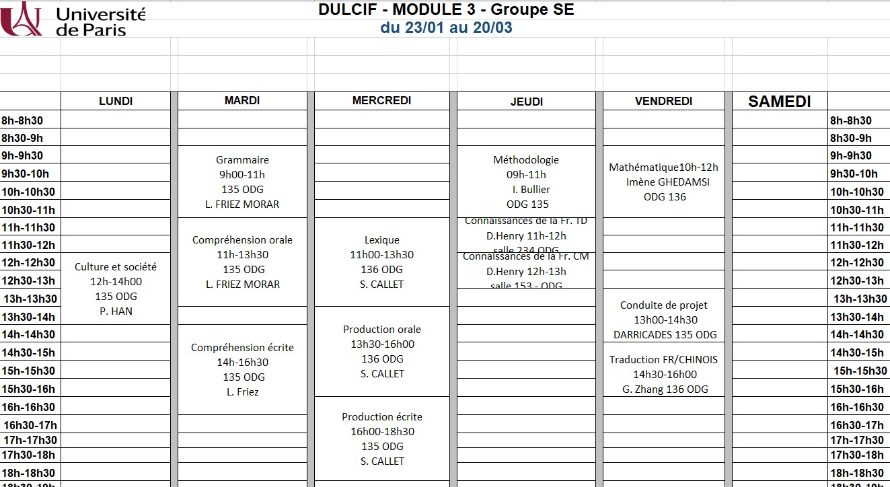

# DULCIF_2023
### Module3 et 4

***
### VACANCES 02/25-03/05
***
### 02/24 VE
> #### Mathématique
> - [Raisonnement analyse et récurrence](Mathématique/C1_Logique%20et%20raisonnement.pdf) excercices 11-13
>
> #### Conduite de project
> - [Étude du texte argumentatif en faisant une fiche de lecture ou résumé](https://www.espacefrancais.com/analyser-un-texte-argumentatif)
>
> #### Traduction FR -> CN
> - [*text 4*](TraductionFR_CHINOIS/texte%204.pdf)
> - [*小改错练习*](TraductionFR_CHINOIS/2.24翻译.pdf)

### 02/23 JE
> #### Méthodologie
>  - [Que faites-vous ?](Méthodologie/situations%20.pdf)
>  - [corriger les e-mails](Méthodologie/Corriger%20les%20e-mails%20.pdf)
>
> #### Connaissance de la France
>  - [TD4](Connaissance_de_la_France/TD4.pdf)
>  - [CM5](Connaissance_de_la_France/DULCIF%20module%203%20CM5%20la%20Réforme%20protestante%20et%20les%20guerres%20de%20religion.pdf)
>

### 02/22 ME
> #### Lexique
> - *词汇渐进*  p102 La Communication
> 
> EXCERCICES:
>> p103 1,2,3,4
>> p105 2,3
>> p107 2
>> p109 1,3,4
>  
> #### Production Orale
> - *ABC_DELF_B2* p146 ACTIVITÉ 14 *Colocation senior-étudiant : le mode d'emploi*
> #### Production écrite
> - *ABC_DELF_B2* p172 ACTIVITÉ 22 (250 mots)
>
> - [*Les connecteurs linguistiques pour bien écrire et argumenter*](Compréhension_Orale_Ecrite/Les%20%20connecteurs%20%20linguistiques%20.pdf)
>
> #### S.CALLET写的一本书
> - [*Répertoire des difficultés du français_Callet S.*](Production_Orale_Ecrite/Répertoire%20des%20difficultés%20du%20français_Callet%20S..pdf)

### 02/21 MA
> #### Grammaire
> - *语法渐进* 
> 
> COURS:
>>   - p80, p82 La Forme Passive
>>   - p154 l'Expression de la Condition et de l'Hypothèse
>
> EXCERCICES:
>>   - p65 5
>>   p67 1
>>   p68 1
>>   p81 1,2
>>   p83 4
>>   p155 1,2
>
> - [*PRÉFIXES ET SUFFIXES*](Grammaire/PRINCIPAUX%20PREFIXES%20ETSUFFIXES.docx)
> - [*Excercices de Préfixes+Suffixes*](Grammaire/Préfixes_Suffixes_Radicaux_exercices.docx)
> - [*EN EFFET/AU FAIT/EN FAIT的区分*](Grammaire/21.2.docx)
> #### Compréhension orale
> - *ABC_DELF_B2* p15 [ACTIVITÉ 7](Compréhension_Orale_Ecrite/audio/DELFB2_CO_P07_activite07_Bonnotte_Noirmoutier.MP3) 
> - *ABC_DELF_B2* p34 [ACTIVITÉ 10](Compréhension_Orale_Ecrite/audio/DELFB2_CO_P32_activite10_sexe%20desenfants.MP3)
> #### Compréhension écrite
> - *ABC_DELF_B2* p62 ACTIVITÉ 5
> - *ABC_DELF_B2* p103 ACTIVITÉ 6

### 02/20 LU
> #### Culture et société
> - *Universalism Républicain et Multiculturalism*

---
###### 2/17 及以前的进度记不清了QwQ 仅参考
### 02/17 VE
> #### Mathématique
> - *raisonnement mathématique* excercise 6 - 10
> #### Conduite de projet
> -
> #### Traduction FR -> CN
> - [*texte 4*](TraductionFR_CHINOIS/texte%204.pdf) (inachevé)

### 02/16 JE
> #### Méthodologie
> -
> #### Connaissances de la France
> - [TD3.5](Connaissance_de_la_France/TD3.5.pdf)
> - [CM4](Connaissance_de_la_France/DULCIF%20module%203%20CM4%20la%20renaissance%20europeÌenne.pdf)

### 02/15 ME
> #### Lexique
> - *词汇渐进* p124 - p129 <20.L'ÉCONOMIE ET LE COMMERCE>
> #### Production Orale
> - *ABC_DELF_B2* p149 ACTIVITÉ 21
> #### Production écrite
> - *ABC_DELF_B2* p172 ACTIVITÉ 23  (250 mots / 50 minutes)

### 02/14 MA
> #### Grammaire
> - *语法渐进* p62-p65 Le Conditionnel
> #### Compréhension orale
> - *ABC_DELF_B2* p14 [ACTIVITÉ 6](Compréhension_Orale_Ecrite/audio/DELFB2_CO_P06_activite06_medicaments.MP3)
> - *ABC_DELF_B2* p33 [ACTIVITÉ 9](Compréhension_Orale_Ecrite/audio/DELFB2_CO_P31_activite09_Reseausemences%20nat.MP3)
> #### Compréhension écrite
> - *ABC_DELF_B2* p60 ACTIVITÉ 4
> - *ABC_DELF_B2* p62 ACTIVITÉ 5 (inachevé)

### 02/13 LU
> #### Culture et société
> - *Culture Traditionnelle Française*

### 02/10 VE
> #### Mathématique
> - *raisonnement mathématique* excercise 2,4,6
> #### Conduite de projet
>  - 
> #### Traduction FR -> CN
> - [*text3*](TraductionFR_CHINOIS/texte%203.pdf)

### 02/09 JE
> #### Méthodologie
> - 
> #### Connaissances de la France
> - [TD3](Connaissance_de_la_France/TD3.pdf)
> - [CM3](Connaissance_de_la_France/DULCIF%20module%203%20CM3%20Une%20Europe%20judeo%20-chrétienne%20_%20.pdf)

### 02/08 ME
> #### Lexique
> - *词汇渐进* p118 - p120
> #### Production Orale
> - *ABC_DELF_B2* p147 ACTIVITÉ 16
> #### Production écrite
> - *ABC_DELF_B2* p170 ACTIVITÉ 8 (250 mots / 50 minutes)

